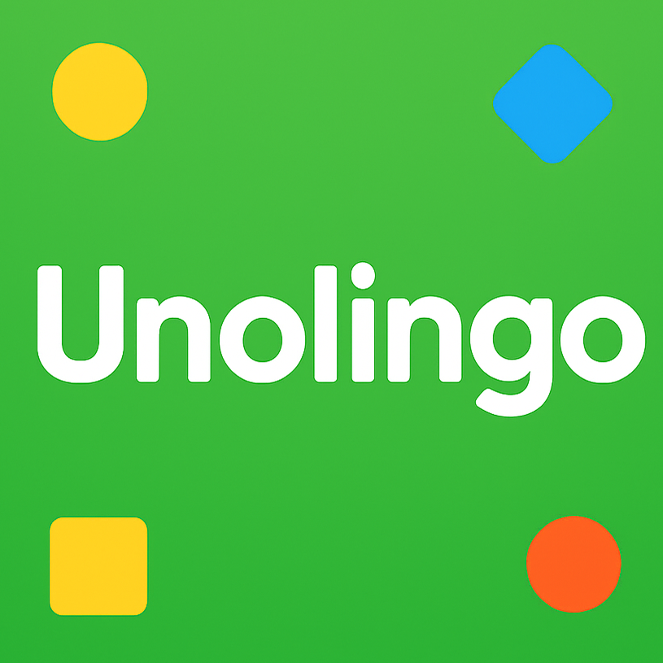
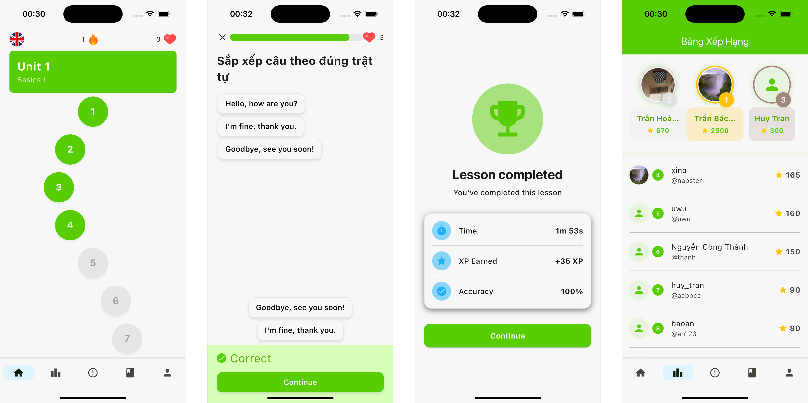

# Unolingo

A language learning app inspired by Duolingo, developed as DUT's Mobile Development final project. The project consists of a Flutter mobile app and a Node.js backend.

## Project Structure

- **mobile/**: Flutter app for iOS and Android
- **backend/**: Node.js/Express backend API
- **docs/**: Documentation and assets

## Features

- Interactive language lessons with a spiral/flow layout
- Performance-optimized lesson list using `ScrollablePositionedList` and `ValueNotifier`
- Modular state management with Bloc
- Parallel data fetching for improved speed

## Getting Started

See `mobile/README.md` and `backend/readme.md` for setup instructions for each part.

## Git Commit Convention

Use [this convention](./docs/git_convention.pdf) (by [HighTenHunter](https://github.com/High10Hunter)).
